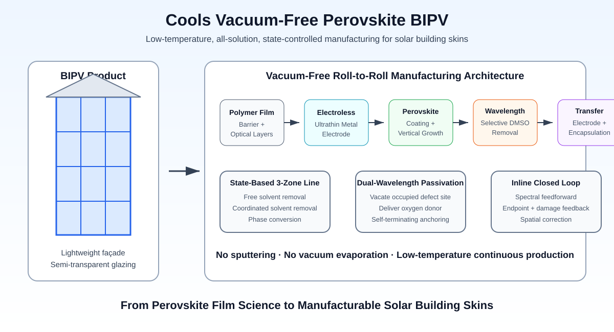

# Cools Vacuum-Free Perovskite BIPV

**A low-temperature, all-solution-processed perovskite solar-cell platform designed for Building-Integrated Photovoltaics (BIPV).**

[한국어](README_KO.md) · [中文](README_ZH.md)

<p align="center">
  
</p>

## Turn the Building Envelope into a Solar-Cell Manufacturing Platform

Building-Integrated Photovoltaics (BIPV) requires more than high laboratory efficiency. Façades, windows, roofs, curved surfaces and lightweight retrofit panels require a manufacturing architecture that is:

- lightweight and compatible with polymer-film substrates;
- low-temperature and compatible with completed multilayer stacks;
- scalable to wide-area continuous production;
- adaptable to transparent and semi-transparent optical designs; and
- free from vacuum-deposition bottlenecks that interrupt roll-to-roll manufacturing.

Cools integrates the electrode stack, perovskite film formation, selective solvent removal, defect passivation and inline state control into a single vacuum-free manufacturing concept.

> **The target is not merely a perovskite cell. It is a continuously manufacturable solar building skin.**

## Core Proposition

Conventional solution-processed perovskite devices still retain vacuum-deposited islands—typically sputtered transparent electrodes or evaporated metal electrodes—and rely on time-and-temperature recipes for drying and annealing.

The Cools platform replaces that fragmented flow with:

```text
Polymer building-skin substrate
→ solution-formed functional and optical layers
→ electroless ultrathin metal electrode
→ state-controlled perovskite coating and crystallization
→ wavelength-selective removal of coordinated residual solvent
→ defect-site-selective passivation
→ transfer-laminated upper electrode and encapsulation
→ continuous vacuum-free roll-to-roll output
```

## 1. Vacuum-Free Device Stack

Every solid layer is derived from solution coating, aqueous electroless metallization or transfer-laminated sheets. The device architecture avoids sputtering, vacuum evaporation, Chemical Vapor Deposition (CVD) and other vacuum-deposition steps.

Representative stack elements include:

- polymer-film substrate and barrier layer;
- solution-processed dielectric optical matching layers;
- amine-functional interfacial layer;
- electrically continuous electroless copper or silver ultrathin electrode;
- solution-processed charge-transport layers;
- solution-processed perovskite absorber;
- transfer-laminated upper electrode sheet; and
- laminated encapsulation integrated with the electrode sheet.

This architecture is directed to low-mass, flexible and semi-transparent BIPV modules rather than conventional heavy glass modules alone.

## 2. State-Based Three-Zone Perovskite Processing

The platform separates three physically different functions that conventional ovens force into one temperature profile:

| Zone | Dominant function | Handover criterion |
|---|---|---|
| Zone 1 | Free-solvent removal by controlled mass transfer | Free-solvent spectral signal below threshold while coordinated solvent remains |
| Zone 2 | Selective removal of coordinated solvent | Coordinated-solvent peak below threshold before substantial final-phase conversion |
| Zone 3 | Equilibrium phase conversion and crystal growth | Target crystalline phase reaches the specified state |

Zone-to-zone transfer is controlled by measurable film state—not merely elapsed time or oven temperature. Inline infrared spectroscopy, optical thickness metrology and crystallographic indicators can be used as handover gates.

## 3. Wavelength-Selective Removal of Coordinated Solvent

Residual coordinating solvent such as dimethyl sulfoxide (DMSO) can remain incorporated in the lead-halide intermediate structure after free-solvent drying. Conventional heating removes it only by raising the temperature of the entire film and substrate.

Cools instead aligns nanosecond pulsed mid-infrared light with the measured vibrational absorption peak of the coordinated solvent and confines the thermal diffusion length within the thin film.

```text
Measured coordinated-solvent absorption peak
→ wavelength alignment
→ nanosecond thermal confinement
→ selective bond release and solvent desorption
→ purge / extraction
→ spectroscopic endpoint confirmation
```

The objective is to remove the process bottleneck before final crystallization while keeping the time-averaged temperature below the degradation threshold of the film and polymer substrate.

## 4. Surface-Triggered Vertical Crystallization

For inkjet- or slot-die-coated films, Cools separates uniform concentration, surface nucleation and directional growth:

1. uniform concentration under controlled pressure or mass transfer before spontaneous nucleation;
2. a scanned surface nucleation trigger, such as a low-momentum dry-gas knife; and
3. directional crystal growth from the surface toward the substrate.

The target structure is a thickness-direction columnar grain architecture with reduced horizontal grain-boundary density, while suppressing coffee-ring thickness variation across printed cells or patterned regions.

## 5. Wavelength-Programmed Defect-Site Passivation

After coordinated solvent removal, under-coordinated lead sites can remain at surfaces, grain boundaries and interfaces. The platform extends from selective removal to defect-site exchange:

```text
First wavelength: remove the coordinated oxygen species occupying the site
→ spectroscopic endpoint gate
Second wavelength: activate a free oxygen-donor group
→ preferential capture at the exposed under-coordinated metal site
→ anchoring-induced spectral shift
→ reduced absorption at the drive wavelength
→ self-limiting termination
```

Carbonyl-, sulfinyl-, phosphine-oxide-, N-oxide- and related oxygen-donor groups can be selected according to their vibrational bands and coordination affinity. The passivating species is intended to localize at defect sites rather than form a continuous insulating blanket over the charge-transport interface.

## 6. Inline Closed-Loop Manufacturing

The process line is organized around measurable chemical and structural states:

- upstream measurement of target-species concentration and peak position;
- feedforward setting of wavelength, pulse count, scan speed and local dose;
- downstream measurement of residual target-species signal;
- independent monitoring of film damage indicators;
- spatially resolved correction across the web width or substrate area;
- selective reprocessing of under-treated regions; and
- recipe updating from accumulated process history.

This converts the line from a fixed time-temperature recipe into a spectroscopically closed manufacturing system.

## BIPV Product Directions

The platform is directed toward:

- lightweight façade modules;
- semi-transparent solar glazing;
- curtain-wall and spandrel integration;
- curved and non-planar architectural surfaces;
- roof and canopy membranes;
- retrofit skins for existing buildings; and
- color- and transmission-engineered architectural photovoltaic panels.

## Conventional Manufacturing versus Cools

| Manufacturing dimension | Conventional perovskite module flow | Cools BIPV platform |
|---|---|---|
| Transparent electrode | Sputtered oxide or vacuum-deposited layer | Solution/electroless ultrathin metal with optical matching |
| Upper electrode | Vacuum evaporation or sputtering | Transfer-laminated electrode sheet |
| Solvent removal | Oven or vacuum bake | Wavelength-selective pulsed removal plus purge |
| Crystallization control | Time-temperature recipe | State-based zone handover and directional growth |
| Defect passivation | Additive diffusion or blanket coating | Wavelength-programmed defect-site coordination |
| Quality control | Post-process inspection | Inline spectroscopic feedforward and feedback |
| Substrate | Mainly rigid glass | Polymer film and lightweight architectural laminates |
| Line architecture | Vacuum islands interrupt continuity | Vacuum-free continuous roll-to-roll concept |

## Strategic Message

> **Perovskite becomes compelling for buildings when the manufacturing method is designed around the building skin—not when a laboratory cell is merely enlarged.**

Cools combines low-temperature chemistry, vacuum-free electrodes, wavelength-selective processing, inline state control and roll-to-roll integration to create a manufacturing route specifically aligned with BIPV.

## Patent Portfolio and Disclosure Boundary

The technology platform is supported by pending patent applications covering the vacuum-free device stack, all-solution roll-to-roll line, state-based three-zone processing, wavelength-selective coordinated-solvent removal, inline closed-loop control, directional crystallization, defect-site exchange and self-terminating passivation.

This repository presents the platform architecture and industrial proposition. Detailed material formulations, optical process windows, exact layer dimensions, pulse conditions and claim charts are reserved for controlled technical and legal discussions.

Publication of this repository does not grant any licence, waiver or permission to practise the technology.

## Collaboration

Cools is seeking technical evaluation and joint development with:

- BIPV module manufacturers;
- façade, glazing and architectural-material companies;
- perovskite solar-cell developers;
- roll-to-roll coating and printing equipment companies;
- laser and inline spectroscopy equipment suppliers; and
- strategic investors and licensing partners.

## Contact

**Cools Inc.**  
Jinhyun Cho  
Former Samsung Electronics Master-level semiconductor engineer  
Ph.D., Mechanical Engineering, University of Michigan

Email: jhcho@cools.co.kr  
Email: jhcho9494@naver.com  
Mobile: +82-10-2280-9414
